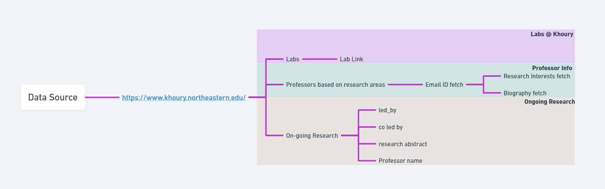

# TA/RA Bot

## Diagram


### Overview

This project aims to create a pipeline for processing data related to Khoury TARA and generating customized emails for TA and RA positions using Gemini.

### Key Components

## Folder Structure

- **Bronze**: Contains the raw data files in CSV format:
  - `facultyInfo.csv`: Information about faculty members.
  - `labs.csv`: Information about labs.
- **DataSource**:
  - **pycache**: Python cache files.
  - **services**:
    - `labs.py`: Python script for handling lab-related data.
    - `metadata.json`: Metadata about the project.
    - `ongoingResearch.py`: Python script for handling ongoing research data.
    - `pipeline.py`: Main Luigi pipeline script.
    - `professorInfo.py`: Python script for handling professor information.
  - `image.png`: Project logo or visualization.
- `readme.md`: This file.
- `requirements.txt`: List of project dependencies.

## Pipeline Overview

The Luigi pipeline defined in `pipeline.py` orchestrates the following tasks:

1. **Extract data**: Reads `facultyInfo.csv` and `labs.csv` files into Pandas DataFrames.
2. **Transform data**: Processes the data, performs cleaning, and creates new features as required.
3. **Load data**: Stores the processed data into the Bronze folder as new CSV files or other desired formats.
4. **Clean data**: Performs further cleaning and preprocessing on the data in the Bronze folder.
5. **Prepare for Gemini**: Formats the data into a suitable structure for Gemini to generate customized emails for TA and RA positions.

## Getting Started

1. **Install dependencies**:
   ```bash
   pip install -r requirements.txt
2. **Run the Pipeline**
    ```bash
    cd .\DataSource
    python pipeline.py

## Additional Notes
* This project is under development and may contain placeholders or incomplete functionalities.
* The specific data cleaning and transformation steps will be defined in the respective Python scripts.
* The integration with Gemini for email generation is a future enhancement.

